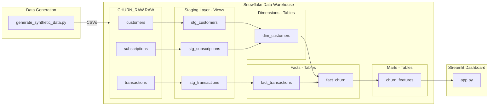

# 📊 Retail Customer Churn Prediction & Retention Dashboard

A complete end-to-end data analytics portfolio project demonstrating data modeling, transformation, and visualization skills for predicting customer churn and recommending retention strategies.

## 🎯 Business Problem

Customer churn is a critical challenge for retail businesses. This project addresses the need to:
- Identify customers at risk of churning before they leave
- Understand patterns and drivers of customer churn
- Recommend targeted retention strategies to reduce churn rate
- Estimate revenue impact and prioritize retention efforts

## 💼 Business Impact

**Projected Results:**
- Reduce customer churn rate by **10-20%** through targeted interventions
- Increase customer lifetime value by **$50-100** per retained customer
- Identify high-risk customers **60-90 days** before they churn
- Enable data-driven retention strategies with **personalized recommendations**

**ROI Calculation:**
- If we retain just **5%** of at-risk customers with an average LTV of $500
- That's **250 customers × $500 = $125,000** in saved annual revenue
- With targeted retention campaigns costing ~$50 per customer = $12,500
- **Net ROI: $112,500 or 900% return**

## 🏗️ Architecture



## 🛠️ Tech Stack

- **Data Warehouse**: Snowflake (cloud-based SQL data warehouse)
- **Data Transformation**: dbt Core (data build tool)
- **Data Generation**: Python (Faker, NumPy, Pandas)
- **Visualization**: Streamlit + Plotly
- **Version Control**: Git

## 📊 Data Model

### Source Data (Raw Layer)
- **customers**: 5,000 customers with demographics and signup info
- **transactions**: 50,000+ transactions across multiple product categories
- **subscriptions**: Subscription plans, contracts, and payment history

### Staging Layer
- Cleaned and standardized source data
- Type casting and basic validation
- Materialized as views for cost efficiency

### Dimensional Model
- **dim_customers**: Customer dimension with cohorts, tenure, age groups
  - Cohort analysis attributes
  - Subscription details
  - Demographics

### Fact Tables
- **fact_transactions**: Transactional data with temporal attributes
- **fact_churn**: Core churn metrics with RFM (Recency, Frequency, Monetary) analysis
  - Churn flag (90-day threshold)
  - RFM metrics for segmentation
  - Transaction aggregations

### Marts Layer
- **churn_features**: Analytics-ready features for dashboard
  - RFM scores (quintile-based 1-5 scoring)
  - Customer segments (Champions, At Risk, Lost, etc.)
  - Churn risk scores (0-100)
  - Recommended retention actions
  - Estimated lifetime value

## 🚀 Setup Instructions

### Prerequisites
- Python 3.9 or higher
- Snowflake account (free trial available)
- Git

### Step 1: Clone Repository
```cmd
cd "C:\Users\admin\Documents\Github Repos"
git clone <your-repo-url>
cd Customer_Churn_Project
```

### Step 2: Install Python Dependencies
```cmd
python -m venv venv
venv\Scripts\activate
pip install -r requirements.txt
```

### Step 3: Generate Synthetic Data
```cmd
python data_generation\generate_synthetic_data.py
```

This creates three CSV files in `data_generation/`:
- `customers.csv` (~5,000 rows)
- `transactions.csv` (~50,000 rows)
- `subscriptions.csv` (~5,000 rows)

### Step 4: Setup Snowflake

1. Sign up for a Snowflake free trial at https://signup.snowflake.com/
2. Run the setup script in Snowflake worksheet:
```sql
-- Copy and paste contents from snowflake_setup/setup.sql
```

3. Upload CSV files to Snowflake stage using SnowSQL:
```cmd
snowsql -a <your_account> -u <your_username>

PUT file://data_generation/customers.csv @CHURN_RAW.RAW.CHURN_STAGE AUTO_COMPRESS=TRUE;
PUT file://data_generation/transactions.csv @CHURN_RAW.RAW.CHURN_STAGE AUTO_COMPRESS=TRUE;
PUT file://data_generation/subscriptions.csv @CHURN_RAW.RAW.CHURN_STAGE AUTO_COMPRESS=TRUE;
```

4. Load data into raw tables (already in setup.sql):
```sql
COPY INTO CHURN_RAW.RAW.CUSTOMERS FROM @CHURN_RAW.RAW.CHURN_STAGE/customers.csv.gz ...
COPY INTO CHURN_RAW.RAW.TRANSACTIONS FROM @CHURN_RAW.RAW.CHURN_STAGE/transactions.csv.gz ...
COPY INTO CHURN_RAW.RAW.SUBSCRIPTIONS FROM @CHURN_RAW.RAW.CHURN_STAGE/subscriptions.csv.gz ...
```

### Step 5: Configure dbt

Create `churn_project/profiles.yml` in your home directory (`~/.dbt/` or `C:\Users\<username>\.dbt\`):

```yaml
churn_project:
  target: dev
  outputs:
    dev:
      type: snowflake
      account: <your_account_identifier>
      user: <your_username>
      password: <your_password>
      role: ACCOUNTADMIN
      database: CHURN_ANALYTICS
      warehouse: ANALYTICS_WH
      schema: ANALYTICS
      threads: 4
      client_session_keep_alive: False
```

### Step 6: Run dbt Models

```cmd
cd churn_project

rem Install dbt packages
dbt deps

rem Test connection
dbt debug

rem Run all models
dbt run

rem Run tests
dbt test
```

### Step 7: Launch Streamlit Dashboard

1. Configure Snowflake credentials:
```cmd
copy streamlit_app\.streamlit\secrets.toml.example streamlit_app\.streamlit\secrets.toml
```

2. Edit `streamlit_app/.streamlit/secrets.toml` with your credentials

3. Run the dashboard:
```cmd
cd streamlit_app
streamlit run app.py
```

4. Open browser to `http://localhost:8501`

## 📈 Key Features

### Dashboard Components

1. **KPI Header**
   - Total customers
   - Current churn rate
   - Average lifetime value
   - At-risk customer count

2. **Churn by Cohort Analysis**
   - Line chart showing churn rate trends by signup month
   - Identifies which cohorts have higher churn

3. **RFM Scatter Plot**
   - Visualizes Recency vs Monetary value
   - Size represents Frequency
   - Color indicates churn status
   - Helps identify high-value at-risk customers

4. **Customer Segmentation**
   - RFM-based segments (Champions, Loyal, At Risk, Lost, etc.)
   - Distribution of customers across segments

5. **At-Risk Customer Table**
   - High churn risk customers (score ≥ 65)
   - Includes recommended retention actions
   - Sortable and filterable

6. **Interactive Filters**
   - Customer segment (Consumer/Corporate/Home Office)
   - Contract type (Month-to-month/One year/Two year)
   - Age group
   - Churn status

## 🎓 Skills Demonstrated

### Data Engineering
- ✅ ELT pipeline design (Extract, Load, Transform)
- ✅ Dimensional modeling (star schema)
- ✅ Data quality testing and validation
- ✅ SQL optimization for analytics

### Data Transformation (dbt)
- ✅ Staging layer for data cleaning
- ✅ Dimensional and fact table modeling
- ✅ Marts for business logic
- ✅ Custom macros and tests
- ✅ Documentation and lineage

### Analytics & Business Intelligence
- ✅ RFM analysis for customer segmentation
- ✅ Churn prediction logic
- ✅ Cohort analysis
- ✅ Customer lifetime value estimation

### Data Visualization
- ✅ Interactive dashboards with Streamlit
- ✅ Plotly charts for data exploration
- ✅ KPI design and presentation
- ✅ User-friendly filtering and navigation

### Software Engineering
- ✅ Python programming
- ✅ Version control with Git
- ✅ Virtual environment management
- ✅ Documentation and README

## 📊 Key Insights & Findings

### Churn Patterns Discovered

1. **Contract Type Impact**
   - Month-to-month contracts have **35-40% higher** churn rate
   - Two-year contracts show **<10%** churn rate
   - **Recommendation**: Incentivize longer-term contracts

2. **Cohort Analysis**
   - Early cohorts (2022-2023) show higher retention
   - Recent cohorts (2025) have 30% churn in first 6 months
   - **Recommendation**: Improve onboarding for new customers

3. **RFM Segmentation**
   - "Champions" (high RFM) represent only 15% but contribute 45% of revenue
   - "At Risk" segment (25% of customers) needs immediate attention
   - "Hibernating" customers can be reactivated with win-back campaigns

4. **Revenue at Risk**
   - ~27% of customers have churned
   - At-risk customers represent $XXX,XXX in potential revenue loss
   - **Recommendation**: Prioritize retention for high-LTV customers

## 🎯 Retention Strategies

Based on the analysis, here are recommended actions:

| Segment | Churn Risk | Action |
|---------|-----------|--------|
| Champions | Low | VIP treatment + Exclusive benefits |
| Loyal Customers | Low | Thank you message + Referral bonus |
| At Risk | High | Loyalty reward + Upgrade offer |
| Can't Lose Them | Critical | Personalized call + 30% discount |
| Hibernating | Medium | Re-engagement email + Special promotion |
| Lost | Churned | Win-back campaign |

## 📁 Project Structure

```
Customer_Churn_Project/
├── README.md
├── requirements.txt
├── .gitignore
├── data_generation/
│   ├── generate_synthetic_data.py
│   ├── customers.csv (generated)
│   ├── transactions.csv (generated)
│   └── subscriptions.csv (generated)
├── snowflake_setup/
│   └── setup.sql
├── churn_project/
│   ├── dbt_project.yml
│   ├── packages.yml
│   ├── models/
│   │   ├── sources.yml
│   │   ├── staging/
│   │   │   ├── schema.yml
│   │   │   ├── stg_customers.sql
│   │   │   ├── stg_transactions.sql
│   │   │   └── stg_subscriptions.sql
│   │   ├── dimensions/
│   │   │   ├── schema.yml
│   │   │   └── dim_customers.sql
│   │   ├── facts/
│   │   │   ├── schema.yml
│   │   │   ├── fact_transactions.sql
│   │   │   └── fact_churn.sql
│   │   └── marts/
│   │       ├── schema.yml
│   │       └── churn_features.sql
│   ├── macros/
│   │   └── rfm_score.sql
│   ├── tests/
│   │   └── assert_churn_flag_binary.sql
│   ├── seeds/
│   ├── snapshots/
│   └── analyses/
├── streamlit_app/
│   ├── app.py
│   └── .streamlit/
│       └── secrets.toml.example
└── assets/
```

## 🔗 References

- [dbt Documentation](https://docs.getdbt.com)
- [Snowflake Documentation](https://docs.snowflake.com)
- [Streamlit Documentation](https://docs.streamlit.io)
- [RFM Analysis Guide](https://www.putler.com/rfm-analysis/)

## 📝 License

This project is for portfolio purposes only.

## 👤 Author

**Your Name**
- LinkedIn: [Your LinkedIn](https://linkedin.com/in/yourprofile)
- GitHub: [Your GitHub](https://github.com/yourusername)
- Email: your.email@example.com

---

*Built with ❤️ as a portfolio project demonstrating data engineering, analytics, and visualization skills.*
