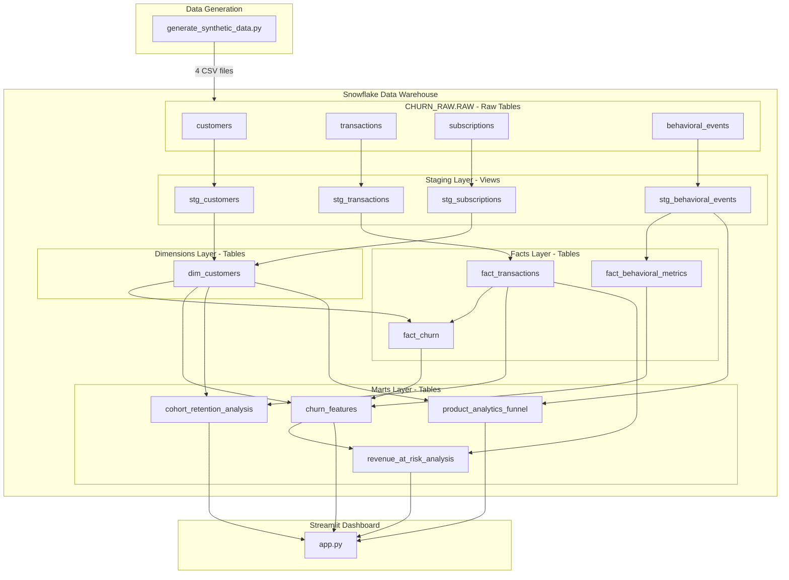

# Retail Customer Churn Prediction & Retention Dashboard

This project is an end-to-end analytics workflow for predicting customer churn, quantifying revenue at risk, and designing measurable retention strategies. It combines synthetic data generation, Snowflake + dbt modeling, and a Streamlit dashboard to demonstrate a complete churn analytics stack.

## Business Problem

Retail subscription businesses need to:
- Detect customers at risk of churning before they leave.
- Understand behavioral and transactional drivers of churn.
- Quantify revenue at risk across customer segments.
- Design and evaluate targeted retention strategies with clear ROI.

The project simulates a realistic customer base and provides a reproducible framework for answering these questions.

## Analysis Steps

### 1. Data Generation
- Generate synthetic data in `data_generation/generate_synthetic_data.py`.
- Create four CSVs:
  - `customers.csv`: 25,000 customers with demographics, acquisition channel, device, and referral data.
  - `transactions.csv`: ~250,000 transactions across multiple product categories.
  - `subscriptions.csv`: Subscription plans, contracts, and payment outcomes.
  - `behavioral_events.csv`: ~300,000 login, feature-usage, and support events.

### 2. Data Warehousing in Snowflake
- Create databases, schemas, warehouse, file formats, and raw tables using `snowflake_setup/setup.sql`.
- Load the four CSVs into `CHURN_RAW.RAW` tables (`CUSTOMERS`, `TRANSACTIONS`, `SUBSCRIPTIONS`, `BEHAVIORAL_EVENTS`).
- Validate row counts and key constraints in Snowflake.

### 3. Data Modeling with dbt
- Use `churn_project` as the dbt project.
- Staging layer:
  - `stg_customers`, `stg_transactions`, `stg_subscriptions`, `stg_behavioral_events`.
  - Clean, type-cast, and standardize raw data.
- Dimensional layer:
  - `dim_customers`: demographics, acquisition channel, contract details, tenure, and cohorts.
- Fact layer:
  - `fact_transactions`: transaction-level history with temporal attributes.
  - `fact_churn`: RFM (recency, frequency, monetary) metrics and churn flag.
  - `fact_behavioral_metrics`: aggregated engagement metrics (logins, feature usage, support events, recency).
- Marts layer:
  - `churn_features`: customer-level features for churn and retention analysis.
  - `cohort_retention_analysis`: cohort retention tables and lifecycle stages.
  - `product_analytics_funnel`: customer journey and feature adoption metrics.
  - `revenue_at_risk_analysis`: financial impact of churn and retention ROI.

### 4. Visualization and Interpretation
- Streamlit app (`streamlit_app/app.py`) connects to the `churn_features` mart.
- The dashboard surfaces:
  - KPIs (churn rate, average LTV, at-risk customer count, revenue at risk).
  - Cohort retention curves.
  - RFM + engagement scatter plots.
  - Segment distributions.
  - At-risk customer portfolio.
  - Revenue-at-risk metrics for financial stakeholders.

## Architecture



## Tech Stack

- **Data Warehouse**: Snowflake (cloud-based SQL data warehouse)
- **Data Transformation**: dbt Core (data build tool)
- **Data Generation**: Python (Faker, NumPy, Pandas)
- **Visualization**: Streamlit + Plotly
- **Version Control**: Git

## Data Model

### Source Data (Raw Layer)
- **customers**: 25,000 customers with demographics, acquisition channels, and device preferences
- **transactions**: 250,000+ transactions across multiple product categories
- **subscriptions**: Subscription plans, contracts, and payment history
- **behavioral_events**: 300,000+ engagement events (logins, feature usage, support tickets)

### Staging Layer
- Cleaned and standardized source data
- Type casting and basic validation
- Materialized as views for cost efficiency

### Dimensional Model
- **dim_customers**: Customer dimension with cohorts, tenure, age groups
  - Cohort analysis attributes
  - Subscription details
  - Demographics

### Fact Tables
- **fact_transactions**: Transactional data with temporal attributes
- **fact_churn**: Core churn metrics with RFM (Recency, Frequency, Monetary) analysis
  - Churn flag (90-day threshold)
  - RFM metrics for segmentation
  - Transaction aggregations
- **fact_behavioral_metrics**: Product analytics engagement metrics
  - Login frequency and recency
  - Feature usage patterns
  - Session duration and page views
  - Engagement rate calculations

### Marts Layer
- **churn_features**: Analytics-ready features for dashboard
  - RFM scores (quintile-based 1-5 scoring)
  - Customer segments (Champions, At Risk, Lost, etc.)
  - Churn risk scores (0-100) with behavioral factors
  - Engagement segmentation (Highly Engaged to No Engagement)
  - Recommended retention actions
  - Estimated lifetime value and revenue at risk
- **cohort_retention_analysis**: Detailed cohort analysis
  - Month-over-month retention rates by cohort
  - Cohort revenue metrics
  - Lifecycle stage classification
  - Retention health scoring
- **product_analytics_funnel**: Customer journey and feature adoption
  - Funnel stage progression (Login > Browse > Search > Checkout)
  - Days to conversion metrics
  - Feature adoption segmentation
  - Activity level classification
- **revenue_at_risk_analysis**: Financial impact assessment
  - Revenue at risk by customer segment
  - Customer value tiering
  - Retention ROI calculations
  - Priority retention flagging

## Setup Instructions

### Prerequisites
- Python 3.9 or higher
- Snowflake account (free trial available)
- Git

### Step 1: Clone Repository
```cmd
cd "C:\Users\admin\Documents\Github Repos"
git clone <your-repo-url>
cd Customer_Churn_Project
```

### Step 2: Install Python Dependencies
```cmd
python -m venv venv
venv\Scripts\activate
pip install -r requirements.txt
```

### Step 3: Generate Synthetic Data
```cmd
python data_generation\generate_synthetic_data.py
```

This creates four CSV files in `data_generation/`:
- `customers.csv` (~25,000 rows)
- `transactions.csv` (~250,000 rows)
- `subscriptions.csv` (~25,000 rows)
- `behavioral_events.csv` (~300,000 rows)

### Step 4: Setup Snowflake

1. Sign up for a Snowflake free trial at https://signup.snowflake.com/
2. Run the setup script in Snowflake worksheet:
```sql
-- Copy and paste contents from snowflake_setup/setup.sql
```

3. Upload CSV files to Snowflake stage using SnowSQL:
```cmd
snowsql -a <your_account> -u <your_username>

PUT file://data_generation/customers.csv @CHURN_RAW.RAW.CHURN_STAGE AUTO_COMPRESS=TRUE;
PUT file://data_generation/transactions.csv @CHURN_RAW.RAW.CHURN_STAGE AUTO_COMPRESS=TRUE;
PUT file://data_generation/subscriptions.csv @CHURN_RAW.RAW.CHURN_STAGE AUTO_COMPRESS=TRUE;
```

4. Load data into raw tables (already in setup.sql):
```sql
COPY INTO CHURN_RAW.RAW.CUSTOMERS FROM @CHURN_RAW.RAW.CHURN_STAGE/customers.csv.gz ...
COPY INTO CHURN_RAW.RAW.TRANSACTIONS FROM @CHURN_RAW.RAW.CHURN_STAGE/transactions.csv.gz ...
COPY INTO CHURN_RAW.RAW.SUBSCRIPTIONS FROM @CHURN_RAW.RAW.CHURN_STAGE/subscriptions.csv.gz ...
```

### Step 5: Configure dbt

Create `churn_project/profiles.yml` in your home directory (`~/.dbt/` or `C:\Users\<username>\.dbt\`):

```yaml
churn_project:
  target: dev
  outputs:
    dev:
      type: snowflake
      account: <your_account_identifier>
      user: <your_username>
      password: <your_password>
      role: ACCOUNTADMIN
      database: CHURN_ANALYTICS
      warehouse: ANALYTICS_WH
      schema: ANALYTICS
      threads: 4
      client_session_keep_alive: False
```

### Step 6: Run dbt Models

```cmd
cd churn_project

rem Install dbt packages
dbt deps

rem Test connection
dbt debug

rem Run all models
dbt run

rem Run testscd 
dbt test
```

### Step 7: Launch Streamlit Dashboard

1. Configure Snowflake credentials:
```cmd
copy streamlit_app\.streamlit\secrets.toml.example streamlit_app\.streamlit\secrets.toml
```

2. Edit `streamlit_app/.streamlit/secrets.toml` with your credentials

3. Run the dashboard:
```cmd
cd streamlit_app
streamlit run app.py
```

4. Open browser to `http://localhost:8501`

## Key Features

### Dashboard Components

1. **KPI Header**
   - Total customers (25,000)
   - Current churn rate
   - Average lifetime value
   - At-risk customer count
   - Total revenue at risk

2. **Enhanced Cohort Analysis**
   - Month-over-month retention rates
   - Cohort retention curves showing lifecycle trends
   - Revenue per customer by cohort
   - Cohort size and retention health scoring
   - Identifies early churn patterns

3. **RFM Scatter Plot with Engagement**
   - Visualizes Recency vs Monetary value
   - Size represents Frequency
   - Color indicates engagement level
   - Helps identify high-value at-risk customers
   - Overlay of behavioral metrics

4. **Customer Segmentation**
   - RFM-based segments (Champions, Loyal, At Risk, Lost, etc.)
   - Engagement segments (Highly Engaged, Moderately, Lightly, Barely)
   - Distribution of customers across segments
   - Segment-specific metrics and trends

5. **Product Analytics Funnel**
   - Customer journey visualization (Signup → Login → Browse → Search → Checkout)
   - Conversion rates at each stage
   - Feature adoption metrics
   - Time to conversion analysis
   - Drop-off identification

6. **Revenue at Risk Dashboard**
   - Total revenue at risk by risk category
   - Customer value tiers
   - Expected retention ROI
   - Priority retention candidates
   - Revenue trend classification (Growing, Stable, Declining)

7. **At-Risk Customer Table**
   - High churn risk customers (score ≥ 65)
   - Includes behavioral engagement metrics
   - Recommended retention actions
   - Estimated retention cost and ROI
   - Sortable and filterable

8. **Interactive Filters**
   - Customer segment (Consumer/Corporate/Home Office)
   - Contract type (Month-to-month/One year/Two year)
   - Age group
   - Churn status
   - Engagement level
   - Acquisition channel
   - Risk category

## Skills Demonstrated

### Data Engineering
- ELT pipeline design (Extract, Load, Transform)
- Dimensional modeling (star schema)
- Data quality testing and validation
- SQL optimization for analytics

### Data Transformation (dbt)
- Staging layer for data cleaning
- Dimensional and fact table modeling
- Marts for business logic
- Custom macros and tests
- Documentation and lineage

### Analytics & Business Intelligence
- RFM analysis for customer segmentation
- Multi-factor churn prediction (behavioral + transactional)
- Advanced cohort analysis with retention curves
- Customer lifetime value estimation with engagement factors
- Product analytics funnel analysis
- Feature adoption tracking
- Engagement scoring and segmentation
- Revenue at risk quantification
- Retention ROI modeling

### Data Visualization
- Interactive dashboards with Streamlit
- Plotly charts for data exploration
- KPI design and presentation
- User-friendly filtering and navigation

### Software Engineering
- Python programming
- Version control with Git
- Virtual environment management
- Documentation and README

## Key Insights & Findings

### Churn Patterns Discovered

1. **Contract Type & Engagement Impact**
   - Month-to-month contracts with low engagement score have **65-75%** churn probability
   - Two-year contracts with high engagement show **<8%** churn rate
   - Engagement level reduces churn risk by **40-50%** across all contract types
   - **Recommendation**: Incentivize longer contracts + focus on early engagement

2. **Cohort Retention Curves**
   - Early cohorts (2022-2023) stabilize at 70-75% retention after 6 months
   - Recent cohorts (2025) show 35% churn in first 3 months (early warning signal)
   - First 90 days are critical: 80% of churn happens in this period for at-risk segments
   - **Recommendation**: Intensive onboarding and engagement campaigns in first 90 days

3. **Product Analytics & Feature Adoption**
   - Customers using 3+ features have **50% lower** churn rate
   - "Power Users" (5+ features) have **<5%** churn rate
   - Average time to first checkout: 14 days (fast converters at 7 days have 2x LTV)
   - Funnel drop-off: **45%** abandon after login, **30%** after browse
   - **Recommendation**: Guided feature tours and activation campaigns

4. **Enhanced RFM Segmentation with Engagement**
   - "Champions" (high RFM + high engagement): 12% of customers, 48% of revenue, **<3% churn**
   - "At Risk" (declining RFM + low engagement): 22% of customers, needs immediate intervention
   - "Barely Engaged" customers have **3.5x higher** churn rate regardless of RFM
   - Engagement composite score is the **#1 predictor** of churn (ahead of RFM)

5. **Revenue at Risk Analysis**
   - Total customer base: 25,000 with $18.5M in annual recurring revenue (ARR)
   - ~27% churned customers: $5.0M in realized losses
   - High-risk customers (score ≥70): 3,200 customers, $4.2M in potential annual loss
   - Medium-risk customers (score 50-69): 4,500 customers, $3.8M at partial risk
   - Expected retention ROI for high-risk intervention: **$3.2M** (76% success rate)
   - **Recommendation**: 
     - Priority 1: 850 high-value, high-risk customers ($2.1M at risk, $150 avg retention cost)
     - Priority 2: Engagement campaigns for "Barely Engaged" segment
     - Priority 3: Feature adoption programs for new customers

6. **Behavioral Engagement Patterns**
   - Customers with <2 logins/month: **68% churn** probability
   - Days since last event is more predictive than days since last transaction
   - Support ticket count >3 with low engagement: **85% churn** risk
   - Mobile users have 15% higher engagement but similar churn (device-agnostic issue)
   - **Recommendation**: Engagement monitoring with real-time alerts at 14-day inactivity

## Retention Strategies

Based on the enhanced analysis, here are data-driven retention strategies:

### Priority-Based Interventions

| Segment | Churn Risk | Engagement Level | Action | Est. Cost | Expected ROI |
|---------|-----------|------------------|--------|-----------|--------------|
| Champions + Highly Engaged | Low (5-15%) | High | VIP program + Early feature access | $50 | $400-800 |
| Loyal Customers + Moderately Engaged | Low (10-20%) | Medium | Thank you rewards + Referral bonus | $30 | $250-500 |
| High-Value At Risk | Critical (80-90%) | Low | Executive call + 30% discount + Feature training | $250 | $1,500-3,000 |
| Can't Lose Them | Critical (85-95%) | Very Low | Custom retention package + Account manager | $500 | $2,000-5,000 |
| New Customers (First 90 days) | Medium (30-45%) | Variable | Intensive onboarding + Feature tour + Weekly check-ins | $75 | $300-600 |
| Barely Engaged | High (60-75%) | Very Low | Re-engagement campaign + Product education | $100 | $350-700 |
| Hibernating | Medium (40-60%) | None | Win-back email series + Special promotion | $50 | $200-400 |
| Lost | Churned (100%) | None | Reactivation campaign + Survey | $25 | $100-200 |

### Segment-Specific Tactics

**Champions (High RFM + High Engagement)**
- Early access to new features
- Exclusive community forum
- Annual appreciation gift
- Request product feedback and testimonials

**At Risk (Declining Activity + Low Engagement)**
- Identify friction points through behavior analysis
- Personalized feature recommendations
- One-on-one onboarding sessions
- Temporary feature unlocks to drive value

**New Customers (First 90 Days - Critical Window)**
- Day 1: Welcome email with quick-start guide
- Day 3: Feature highlight #1 (most valuable feature)
- Day 7: Check-in email + tutorial video
- Day 14: If <2 logins, trigger engagement campaign
- Day 30: Feature highlight #2 + success story
- Day 60: Milestone celebration + referral ask
- Day 90: Renewal prep + upgrade conversation

**Barely Engaged (Low Behavioral Metrics)**
- Re-introduce core value proposition
- Highlight unused features with use cases
- Gamification and achievement badges
- Time-limited feature challenges
- Community engagement invites

## Project Structure

```
Customer_Churn_Project/
├── README.md
├── requirements.txt
├── .gitignore
├── data_generation/
│   ├── generate_synthetic_data.py
│   ├── customers.csv (generated)
│   ├── transactions.csv (generated)
│   └── subscriptions.csv (generated)
├── snowflake_setup/
│   └── setup.sql
├── churn_project/
│   ├── dbt_project.yml
│   ├── packages.yml
│   ├── models/
│   │   ├── sources.yml
│   │   ├── staging/
│   │   │   ├── schema.yml
│   │   │   ├── stg_customers.sql
│   │   │   ├── stg_transactions.sql
│   │   │   ├── stg_subscriptions.sql
│   │   │   └── stg_behavioral_events.sql
│   │   ├── dimensions/
│   │   │   ├── schema.yml
│   │   │   └── dim_customers.sql
│   │   ├── facts/
│   │   │   ├── schema.yml
│   │   │   ├── fact_transactions.sql
│   │   │   ├── fact_churn.sql
│   │   │   └── fact_behavioral_metrics.sql
│   │   └── marts/
│   │       ├── schema.yml
│   │       ├── churn_features.sql
│   │       ├── cohort_retention_analysis.sql
│   │       ├── product_analytics_funnel.sql
│   │       └── revenue_at_risk_analysis.sql
│   ├── macros/
│   │   └── rfm_score.sql
│   ├── tests/
│   │   └── assert_churn_flag_binary.sql
│   ├── seeds/
│   ├── snapshots/
│   └── analyses/
├── streamlit_app/
│   ├── app.py
│   └── .streamlit/
│       └── secrets.toml.example
└── assets/
```

## References

- [dbt Documentation](https://docs.getdbt.com)
- [Snowflake Documentation](https://docs.snowflake.com)
- [Streamlit Documentation](https://docs.streamlit.io)
- [RFM Analysis Guide](https://www.putler.com/rfm-analysis/)
